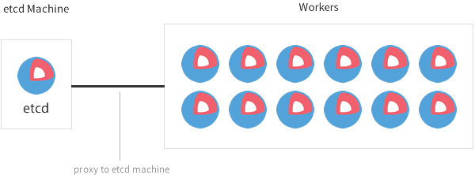

name: tmpl-inverse
layout: true
class: center, middle, inverse

.footnote[
  [Accueil](#cover) -
  Pierre Verkest - [@petrusv84](http://twitter.com/petrusv84) -
  [fork this prez](https://github.com/petrus-v/coreos-prez)
]

---
name: cover
template: tmpl-inverse

# CoreOs
[coreos-prez]

.headnote[
  P: presenter mode -
  C: clone mode
]

???

préparer la démo:

  * ouvrir 3 consoles vers les coreos

  * faire le ménage
  

* cleanup

```bash
fleetctl list-unit-files
fleetctl destroy unit
```

---
name: summarise
layout: false
class: center, top

# Sommaire

### [Introduction](#intro)
### [Concepts et composants de CoreOs](#concepts)
### [Démo](#demo)
### [CoreOs chez Anybox?](#anybox)

---
name: intro
template: tmpl-inverse

## Introduction

[CoreOs c'est quoi ?](#kesako)

[Organisation d'un cluster ?](#dev-cluster)

[Orchestration des containers ?](#Orchestration)

---
name: kesako

.left-column[
  ## Intro
  ### C'est quoi?
]
.right-column[


## Système:


## Engine:


## Cluster:


]

???

Objectifs de l'OS:

* Un système d'exploitation
  * Sécurité
  * Cohérence
  * Fiabilité

* Prévu pour gerer des container (rkt / docker)

* Prévu pour fonctionner en cluster

---


name: dev-cluster
count: false

.left-column[
  ## Intro
  ### C'est quoi?
  ### Cluster
]
.right-column[

## Cluster de développement



]

???

N'est pas tolérant à la panne

---

name: small-cluster

.left-column[
  ## Intro
  ### C'est quoi?
  ### Cluster
]
.right-column[

## Petit cluster


]

???

Tolérance aux pannes


---

name: prod-cluster
count: false

.left-column[
  ## Intro
  ### C'est quoi?
  ### Cluster
]
.right-column[

## Cluster de production


]

---

name: orchestration

.left-column[
  ## Intro
  ### C'est quoi?
  ### Cluster
  ### Orches- tration
]
.right-column[

### CoreOs Fleet


### Docker Swarm


### kubernetes


### Apache Mesos


]

???

L'orchestration c'est quoi? Prend en charge:

* Gestion des container
* Gestion de découverte de service (service discovery)
    * Gestion du réseau
* Gestion de repartition de charge (load-balancing)
* Gestion des points de montage
* Permet de mettre à jour les applicatifs de manière automatisé

*CoreOs Fleet*: Systemd distribué / détermine le noeud où démarrer le CT 

*Docker swarm*: virtual Docker engine.

*Kubernetes*: 
  * Pod (1 à N container)
  * Replication Controllers (s'assure du nombre de pod en route)
  * Service (1 à N Pods expose le service à l'exterieur du cluster /
    IP address / DNS / load balancer)

*Apache Mesos*: le kernel distribué!

---
template: tmpl-inverse
name: concepts

## Comment ça fonctionne ?

[Gestionnaire de paquets](#packaging)

[Mise à jour du système](#upgrade)

[Principaux composants](#components)

---
name: packaging
class: center, top

.left-column[
  ## How it works?
  ### Packaging
]
.right-column[

Il n'y en a pas !

]

???

Apt, Yum

---
name: upgrade
class: center, top

.left-column[
  ## How it works?
  ### Packaging
  ### Upgrade
]
.right-column[


]

???

Avantages:

 * cohérence entre les applicatifs 
 * rapide à mettre à jour
 * atomic et réversible

---

name: components

.left-column[
  ## How it works?
  ### Packaging
  ### Upgrade
  ### Les composants
]
.right-column[

* Kernel linux
* Ignition / cloud-config
* etcd
* systemd
* fleet
* rkt / docker
* locksmith
* flannel
* clair
* ...

]

???

écris en GO-lang


---
name: demo
template: tmpl-inverse

# Démos

[etcd](#etcd)

[rkt / docker](#docker)

[systemd](#systemd)

[fleet](#fleet-simple)

---

name: etcd

.left-column[
  ## Démo
  ### etcd
]
.right-column[

## ajouter ou modifier une entrée
```bash
core@coreos01 ~ $ etcdctl set /message HelloWorld
```

## récupérer une valeur
```bash
core@coreos02 ~ $ etcdctl get /message 
```

## lister les entrées
```bash
core@coreos02 ~ $  etcdctl ls / --recursive
```

## supprimer une entrée
```bash
core@coreos02 ~ $ etcdctl rm /message 
```

]

???

Penser à changer de fenêtre pour montrer que c'est distribué

---

name: systemd

.left-column[
  ## Démo
  ### etcd
  ### systemd
]
.right-column[

```bash
core@coreos01 ~ $ cat /etc/systemd/system/hello.service 
core@coreos01 ~ $ sudo systemctl enable /etc/systemd/system/hello.service
core@coreos01 ~ $ sudo systemctl start hello.service
core@coreos01 ~ $ journalctl -f -u hello.service
core@coreos01 ~ $ sudo systemctl stop --no-block hello.service
core@coreos01 ~ $ sudo systemctl disable hello.service
```

]

???

Démo inspiré de la [documentation CoreOs](https://coreos.com/
fleet/docs/latest/launching-containers-fleet.html#types-of-fleet-units)

---

name: fleet-simple

.left-column[
  ## Démo
  ### etcd
  ### systemd
  ### fleet
]
.right-column[

## 1/5 Simple examples:

```bash
core@coreos01 ~/prez-fleet $ fleetctl list-machines
core@coreos01 ~/prez-fleet $ cat hello.service
core@coreos01 ~/prez-fleet $ fleetctl start hello.service
core@coreos01 ~/prez-fleet $ fleetctl list-units
```

## 2/5 Global examples:

```bash
core@coreos01 ~/prez-fleet $ cat datadog.service
core@coreos01 ~/prez-fleet $ fleetctl start datadog.service
core@coreos01 ~/prez-fleet $ fleetctl list-units
```

]

???

* même service hello the world mais dans le cluster cluster

* dire qu'il y a 2 types de unit fleet: *standart* ou *global*

* montrer qu'il est positionner sur un autre noeud lorsque l'on arrête
  fleet

```bash
core@coreos0? ~ $ sudo systemctl stop fleet
core@coreos0? ~ $ fleetctl list-units
core@coreos0? ~ $ sudo systemctl start fleet
```

* visit https://app.datadoghq.com/infrastructure/map

---

name: fleet-ha
count: false

.left-column[
  ## Démo
  ### etcd
  ### systemd
  ### fleet
]
.right-column[

## 3/5 Haute disponibilité:

```bash
core@coreos01 ~/prez-fleet $ fleetctl list-machines
core@coreos01 ~/prez-fleet $ cat apache@.service
core@coreos01 ~/prez-fleet $ fleetctl start apache@1
core@coreos01 ~/prez-fleet $ fleetctl start apache@2
core@coreos01 ~/prez-fleet $ fleetctl list-units
core@coreos01 ~/prez-fleet $ wget 10.10.20.5?
core@coreos01 ~/prez-fleet $ cat index.html
```

]

???

* Refaire le test d'stop/start de fleet

```bash
core@coreos0? ~ $ fleetctl list-units
core@coreos0? ~ $ sudo systemctl stop fleet
core@coreos0? ~ $ fleetctl list-units
core@coreos0? ~ $ sudo systemctl start fleet
```

* nettoyer le fichier

```bash
core@coreos01 ~/prez-fleet $ rm index.html
```

---


name: fleet-discovery
count: false

.left-column[
  ## Démo
  ### etcd
  ### systemd
  ### fleet
]
.right-column[

## 4/5 Service discovery:

```bash
core@coreos01 ~/prez-fleet $ fleetctl list-machines
core@coreos01 ~/prez-fleet $ cat apache-discovery@.service
core@coreos01 ~/prez-fleet $ fleetctl start apache-discovery@1
core@coreos01 ~/prez-fleet $ fleetctl start apache-discovery@2
core@coreos01 ~/prez-fleet $ fleetctl list-units
core@coreos01 ~/prez-fleet $ etcdctl ls /services/ --recursive
core@coreos01 ~/prez-fleet $ etcdctl get /services/website/apache@1
```

]

???

sidedick example

* Refaire le test d'stop/start de fleet si le temps

```bash
core@coreos0? ~ $ fleetctl list-units
core@coreos0? ~ $ sudo systemctl stop fleet
core@coreos0? ~ $ fleetctl list-units
core@coreos0? ~ $ sudo systemctl start fleet
```


---


name: fleet-metadata
count: false

.left-column[
  ## Démo
  ### etcd
  ### systemd
  ### fleet
]
.right-column[

## 5/5 Filtrer sur les metadata:

```bash
core@coreos01 ~/prez-fleet $ fleetctl list-machines
```

add metadata in ``/etc/systemd/system/fleet.service.d/
40-fleet-metadata.conf``

```bash
core@coreos01 ~/prez-fleet $ fleetctl list-machines
core@coreos01 ~/prez-fleet $ cat meta.service
core@coreos01 ~/prez-fleet $ fleetctl start meta.service
core@coreos01 ~/prez-fleet $ fleetctl list-units
```

]

???

* ajouter des metadata

```bash
core@coreos02 ~ $ sudo mkdir /etc/systemd/system/fleet.service.d/
core@coreos02 ~ $ cat /etc/systemd/system/fleet.service.d/40-fleet-metadata.conf 
[Service]
Environment="FLEET_METADATA=criticity=dev"
core@coreos02 ~ $ sudo systemctl daemon-reload
core@coreos02 ~ $ sudo systemctl restart fleet
```


* cleanup

```bash
fleetctl list-unit-files
fleetctl destroy unit
```

---

name: anybox
template: tmpl-inverse

## CoreOs chez Anybox ?

???

* Evaluer le potentiel dans le cadre d'hébergement de solutions variées

* Profiter d'outils permettant de gerer des clusters d'application 
  hétérogène

Convaicu par le fait d'utiliser des containers + flexibilité :
* bon niveau d'abstraction 
    * réseau
    * gestion de l'espace disque

* permet de faire communiquer les devs et opérations language commun

* Coreos est naturellement prévu pour faire du containers 

  Rien de décider c'est une ETUDE
  donner examples de ce que cela pourrait être

---
name: anwser
template: tmpl-inverse

## Des questions ?
