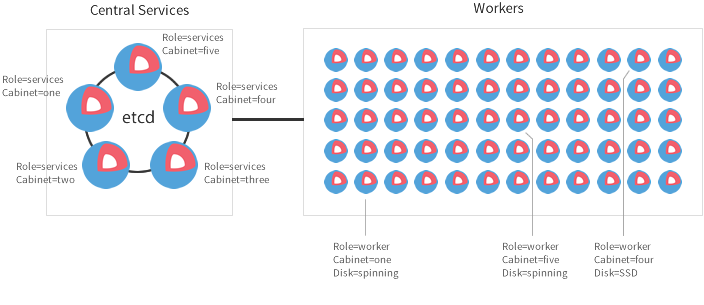

name: intro
template: tmpl-inverse

## Introduction

[CoreOs c'est quoi ?](#kesako)

[Organisation d'un cluster ?](#dev-cluster)

[Orchestration des containers ?](#Orchestration)

---
name: kesako

.left-column[
  ## Intro
  ### C'est quoi?
]
.right-column[

## Système:

## Engine:

## Cluster:

]

???

Objectifs de l'OS:

* Un système d'exploitation
  * Sécurité
  * Cohérence
  * Fiabilité

* Prévu pour gerer des container (rkt / docker)

* Prévu pour fonctionner en cluster

---

name: dev-cluster
count: false

.left-column[
  ## Intro
  ### C'est quoi?
  ### Cluster
]
.right-column[

## Cluster de développement

]

???

N'est pas tolérant à la panne

---

name: small-cluster

.left-column[
  ## Intro
  ### C'est quoi?
  ### Cluster
]
.right-column[

## Petit cluster

]

???

Tolérance aux pannes

---

name: prod-cluster
count: false

.left-column[
  ## Intro
  ### C'est quoi?
  ### Cluster
]
.right-column[

## Cluster de production

]

---

name: orchestration

.left-column[
  ## Intro
  ### C'est quoi?
  ### Cluster
  ### Orches- tration
]
.right-column[

### CoreOs Fleet

### Docker Swarm

### kubernetes

### Apache Mesos

]

???

L'orchestration c'est quoi? Prend en charge:

* Gestion des container
* Gestion de découverte de service (service discovery)
    * Gestion du réseau
* Gestion de repartition de charge (load-balancing)
* Gestion des points de montage
* Permet de mettre à jour les applicatifs de manière automatisé

*CoreOs Fleet*: Systemd distribué / détermine le noeud où démarrer le CT 

*Docker swarm*: virtual Docker engine.

*Kubernetes*: 
  * Pod (1 à N container)
  * Replication Controllers (s'assure du nombre de pod en route)
  * Service (1 à N Pods expose le service à l'exterieur du cluster /
    IP address / DNS / load balancer)

*Apache Mesos*: le kernel distribué!

---
