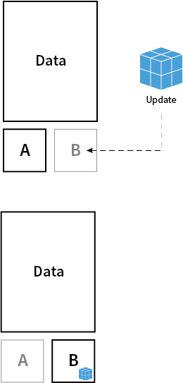

template: tmpl-inverse
name: concepts

## Comment ça fonctionne ?

[Gestionnaire de paquets](#packaging)

[Mise à jour du système](#upgrade)

[Principaux composants](#components)

---
name: packaging
class: center, top

.left-column[
  ## How it works?
  ### Packaging
]
.right-column[

Il n'y en a pas !

]

???

Apt, Yum

---
name: upgrade
class: center, top

.left-column[
  ## How it works?
  ### Packaging
  ### Upgrade
]
.right-column[

]

???

Avantages:

 * cohérence entre les applicatifs 
 * rapide à mettre à jour
 * atomic et réversible

---

name: components

.left-column[
  ## How it works?
  ### Packaging
  ### Upgrade
  ### Les composants
]
.right-column[

* Kernel linux
* Ignition / cloud-config
* etcd
* systemd
* fleet
* rkt / docker
* locksmith
* flannel
* clair
* ...

]

???

écris en GO-lang

---
